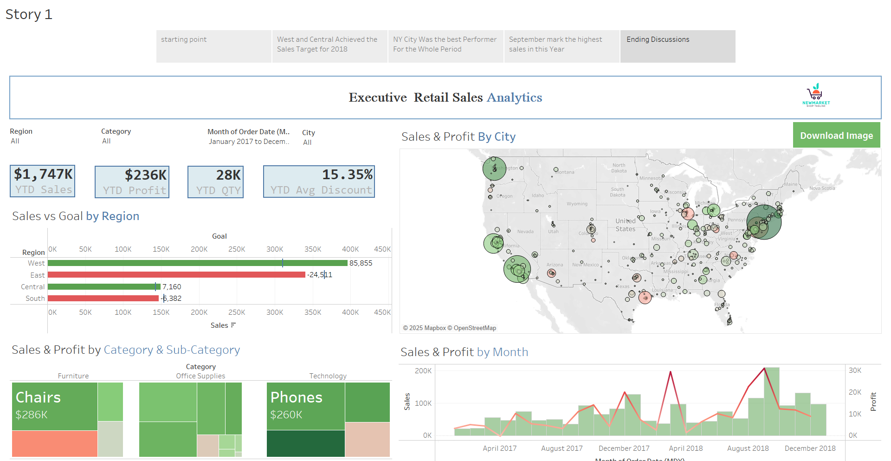

# Retail_Sales_Analysis
# Overview

The Executive Retail Sales Analytics Dashboard is a Tableau-based visualization designed to analyze and track retail sales performance across different regions, categories, and time periods. It provides key insights into year-to-date (YTD) sales, profit, quantity, and discount trends, helping stakeholders make data-driven decisions.

 &nbsp;

# Features

Sales & Profit Analysis: Track YTD sales, profit, and quantity with interactive visuals.

Regional Performance: Compare sales goals versus actual sales performance by region.

Category & Sub-Category Insights: Identify top-performing product categories (e.g., furniture, office supplies, technology).

Geographic Sales Trends: Visualize sales and profit distribution across different cities using a dynamic map.

Monthly Trends: Identify seasonal trends and peak sales months with interactive time-series analysis.

Custom Filters: Adjust views by region, category, order date, and city for tailored insights.

# Technology Used

Tableau: For interactive data visualization.

SQL: For data extraction and transformation (if applicable).

Excel/CSV: For data storage and preprocessing.

Mapbox: For geographic visualization.

OpenStreetMap: For location-based insights.

